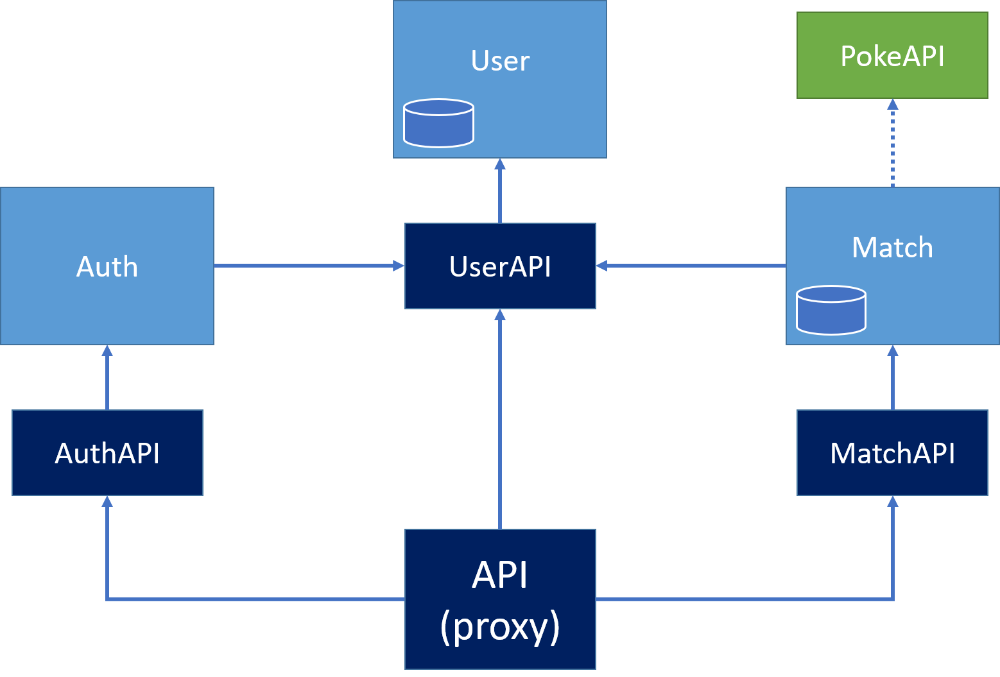

# Poke-fu-mi

## Architecture des services

## Explication des services

-	Un service User, gérant une base de données d’utilisateurs, la création d’utilisateurs, la connexion.
-	Un service Match, gérant une base de données de matchs, la création/modification de matchs. Pour chaque match, ce service effectue aussi la gestion des rounds.
Il se connecte au service User pour définir les joueurs participant à un match.
Il se connecte à la PokeAPI pour définir le déroulement du round selon les pokémons choisis.
-	Un service Auth pour l’authentification. Une fois authentifié, un jeton secret est généré et envoyé, qui permet d’accéder aux autres fonctionnalités de l’API.
-	Un service proxy qui fournit un point d’accès unique aux différents services créés.

## Documentation
Les documentations des services sont accessibles aux adresses suivantes :  
- localhost:5000/docs : UserAPI  
- localhost:5001/docs : MatchAPI  
- localhost:5002/docs : AuthAPI  

## Choix techniques

-	Nous avons choisi de conserver les matchs et les rounds en un seul service, en raison du lien fort entre les deux. Les séparer aurait nécessité un nombre trop conséquent d’appels d’un service à l’autre, et n’aurait donc pas eu d’impact positif notable.
